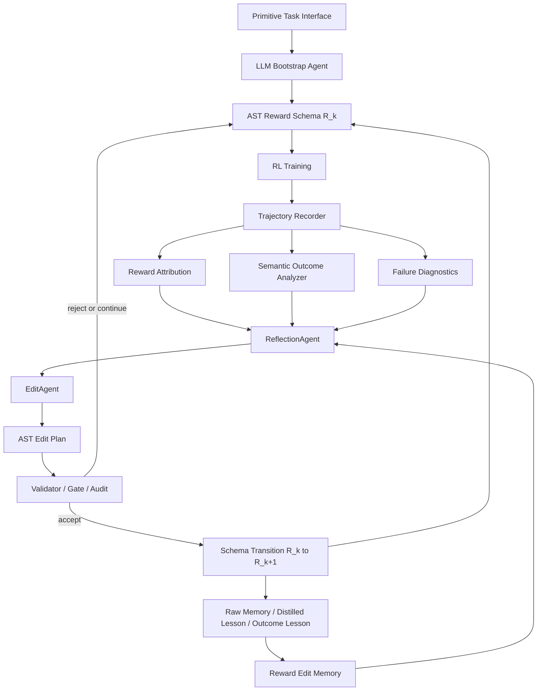

# EG-RSA 会议论文前三章草稿（中文结构稿）

> 目标：不是最终 LaTeX，而是给 `main_eg_rsa_v2.tex` 重写用的会议风格内容草稿。  
> 论文正文按当前已完成贡献写：primitive-interface-conditioned reward self-evolution with structured AST schemas。  
> Eureka-like raw env.py/step 输入只放入未来工作，不写成当前已完成贡献。

---

## 标题建议

**EG-RSA: Experience-Guided Reward Self-Evolution with Large Language Model Agents**

备选：

**From Reward Generation to Reward Self-Evolution: Diagnosing and Editing Reinforcement Learning Rewards with LLM Agents**

---

## Abstract 草稿

Reward design remains a central bottleneck in reinforcement learning: a reward function must provide dense and learnable guidance while preserving alignment with the intended task objective. Recent large language model (LLM)-based approaches such as reward code generation have shown that LLMs can produce useful reward functions from task descriptions, but they often treat reward design as a one-shot or candidate-level generation problem. In this work, we propose EG-RSA, an experience-guided reward self-evolution framework that represents rewards as structured, editable AST schemas and iteratively improves them through rollout diagnostics, semantic outcome analysis, and reward-edit memory. EG-RSA separates reward reflection from reward editing: a ReflectionAgent interprets trajectory-level evidence and retrieved reward-edit experiences, while an EditAgent proposes constrained schema edits that are validated before training the next policy. Experiments on LunarLander show that EG-RSA can start from an imperfect LLM-generated reward schema, diagnose component dominance and shaping-goal mismatch, and produce reward edits that shift the learned behavior from hovering to landing-like high-return policies. Our results suggest that reward design should be treated not merely as reward generation, but as an iterative self-evolution process over structured reward representations.

---

# 1. Introduction

Reinforcement learning agents optimize what they are rewarded for, not necessarily what designers intend. This makes reward design both powerful and fragile: a reward function that is too sparse may fail to guide exploration, while a dense shaping reward may be exploited in ways that optimize the proxy but fail the task. Such reward misspecification has long been recognized in reinforcement learning and AI safety, appearing in reward hacking, specification gaming, and unintended optimization of proxy objectives.

Manual reward engineering remains common in robotics and continuous-control tasks. Designers often combine progress terms, stability terms, terminal bonuses, and action penalties to make policies trainable. However, the resulting reward functions are difficult to write, tune, and debug. A small change in scale or condition may shift the learned behavior from task completion to hovering, bouncing, looping, or energy-saving inactivity. Classical reward shaping and inverse reinforcement learning provide important foundations, but they either require carefully designed potentials, demonstrations, or explicit task specifications.

Large language models have recently opened a new route for automatic reward design. Systems such as Text2Reward and Eureka show that LLMs can synthesize executable reward code from language descriptions and environment interfaces. These methods significantly reduce human effort and demonstrate that LLMs can encode useful task priors. Yet reward design is rarely solved in one attempt. An initial LLM-generated reward may omit a crucial shaping signal, overemphasize an easy proxy, or define terminal success too loosely. Therefore, the central question is not only how to generate a reward function, but how to diagnose and improve it after observing the behavior it induces.

We argue that reward design should be treated as **reward self-evolution**: an iterative process in which reward functions are edited based on training trajectories, component attribution, semantic outcome metrics, and experience memory. This perspective differs from candidate-level reward search. Instead of generating independent reward candidates and selecting the best one, EG-RSA maintains an evolving reward schema and records each reward edit as an experience transition with before/after evidence.

This paper introduces **EG-RSA**, an Experience-Guided Reward Self-Evolution framework with LLM agents. EG-RSA represents rewards as structured AST schemas rather than unrestricted Python code. The schema contains dense formula components, conditional components, sparse event predicates, semantic roles, timing labels, and behavior channels. Each formula and event condition is expressed as a validated abstract syntax tree, allowing reward editing to be constrained, auditable, and executable.

EG-RSA uses a multi-agent loop. A trainer learns a policy under the current reward schema and records trajectories. A diagnostic module computes reward component attribution, semantic outcome metrics, and failure modes such as component dominance or shaping-goal mismatch. A ReflectionAgent interprets the evidence and retrieved reward-edit memories, while an EditAgent proposes constrained schema edits. The resulting edit plan is validated and committed before the next training iteration. Memory stores raw reward-edit traces, distilled lessons, and outcome lessons, enabling future iterations to reuse prior experience.

We evaluate EG-RSA on LunarLander as a case study in reward self-evolution. Starting from an LLM-generated initial schema, the policy initially learns to hover because a center-guidance reward dominates the generated reward. EG-RSA diagnoses this failure and edits the schema by reducing the over-dominant component and introducing descent guidance, producing a qualitative shift from hovering to landing-like behavior. The experiment also reveals an important challenge: internal success predicates can disagree with official posthoc returns, and reward search may oscillate when memory evaluation is not sufficiently aligned. These findings motivate treating reward self-evolution as a distinct research problem rather than a solved extension of reward generation.

Our contributions are:

1. We formulate reward design as an iterative reward self-evolution problem over structured reward schemas.
2. We propose an AST-first reward schema representation that constrains LLM-generated reward edits while preserving semantic flexibility.
3. We design an agentic reward editing loop that combines trajectory diagnostics, reflection, edit validation, and reward-edit memory.
4. We present LunarLander experiments showing that EG-RSA can repair an imperfect LLM bootstrap reward and induce a qualitative behavior shift, while exposing open challenges in semantic success alignment and search stability.

---

# 2. Related Work

## 2.1 Reward Design, Reward Shaping, and Reward Misspecification

Reward design is a foundational difficulty in reinforcement learning. Potential-based reward shaping provides theoretical guarantees that shaping terms can preserve optimal policies when constructed in a specific form, but the potential function itself must still be designed by humans. Inverse reinforcement learning addresses the problem from another angle by inferring rewards from expert demonstrations, but it requires behavioral data and does not directly solve reward debugging for new tasks without demonstrations. Reward machines expose structured reward functions and allow the agent to exploit reward structure, yet they typically rely on user-specified or separately learned automata.

A complementary line of work studies what happens when rewards are misspecified. Reward hacking and specification gaming show that agents may exploit proxy rewards rather than satisfy intended goals. This motivates the need for reward diagnostics: a reward function should not only be executable, but also inspectable and editable after observing induced behavior. EG-RSA follows this view by analyzing reward component attribution and semantic outcomes before editing the reward schema.

## 2.2 LLM-Based Reward Generation

Large language models have recently been used to automate reward design. Text2Reward generates dense reward code from natural language goals and compact environment representations. Eureka uses LLMs to generate reward programs and improves them through evolutionary in-context optimization. DrEureka extends this idea to sim-to-real transfer by generating both rewards and domain randomization settings. Auto MC-Reward applies LLM reward design, reward critique, and trajectory analysis to Minecraft tasks.

These methods demonstrate that LLMs can encode useful task priors and reduce human reward engineering. However, they typically focus on reward generation or candidate optimization. The reward function is often treated as code produced by the LLM, and the history of reward edits is not the central object. EG-RSA instead treats the reward as an evolving structured schema. The LLM does not freely write arbitrary reward code; it proposes constrained schema edits grounded in diagnostics and memory.

## 2.3 Language Agents with Reflection and Memory

LLM agents extend language models with tool use, memory, planning, and reflection. ReAct interleaves reasoning and action, enabling LLMs to interact with external environments. Reflexion introduces verbal reinforcement learning, where agents store reflective memories from feedback and reuse them in later trials. Self-Refine demonstrates that LLM outputs can be iteratively improved through self-feedback. Voyager uses environment feedback and a growing skill library for open-ended Minecraft exploration. Generative Agents highlight the importance of memory retrieval and reflection for believable long-term behavior. Multi-agent frameworks such as AutoGen and EvoAgent further show how specialized agents and evolutionary agent structures can support complex tasks.

EG-RSA is inspired by these agentic patterns but applies them to a different object: the reward function itself. Our memory does not store general task solutions or executable skills; it stores reward-edit transitions, including failure modes, attribution evidence, edit plans, and measured outcomes. This makes memory directly relevant to reward self-evolution.

## 2.4 Structured Reward Representations and EG-RSA's Position

Direct reward code generation is flexible but can be brittle: generated code may be syntactically invalid, semantically unsafe, or difficult to edit locally. Structured reward representations address this by exposing reward components and conditions. EG-RSA follows this direction with an AST-first reward schema. Dense components, conditional components, and event predicates are represented as typed schema elements with semantic roles and validated formula ASTs.

This places EG-RSA at the intersection of LLM reward generation, structured reward specification, and agentic self-improvement. Compared with LLM reward generation methods, EG-RSA emphasizes iterative reward editing rather than one-shot synthesis. Compared with general LLM agents, EG-RSA specializes reflection and memory for reward search. Compared with reward machines or classical reward shaping, EG-RSA uses LLM agents to propose and adapt reward structure from training evidence.

---

# 3. Method: Experience-Guided Reward Self-Evolution

## 3.1 Problem Setting

We consider a reinforcement learning environment with state observations, actions, transition dynamics, and an initial task description. Instead of assuming a fixed reward function, we aim to construct and iteratively improve a reward schema used to train the policy. At iteration \(k\), the policy is trained under reward schema \(R_k\), producing trajectories \(\tau_k\). EG-RSA then computes diagnostic evidence \(D_k\), retrieves relevant reward-edit memories \(M_k\), and proposes an edit plan \(E_k\). If the edit is valid, it is applied to produce \(R_{k+1}\). The objective is not merely to maximize one scalar reward during a single training run, but to improve the reward schema as an artifact across iterations.

The current implementation assumes a primitive task interface that exposes allowed observation/action variables and safe formula variables. Extending this interface to fully automatic extraction from raw environment code is part of our next-step plan rather than a completed contribution.

## 3.2 AST-First Reward Schema

EG-RSA represents a reward function as a structured schema containing two main classes of reward items:

1. **Formula components**, which provide dense reward or penalty signals computed from primitive variables.
2. **Event predicates**, which provide sparse bonuses or penalties when Boolean conditions are satisfied.

Each reward item has a name, weight, enabled flag, semantic role, reward timing, and behavior channel. Semantic roles include dense guidance, stability quality, terminal success, safety constraint, and control cost. These roles allow diagnostics and memory to reason about the behavioral purpose of each component rather than only its name.

Crucially, formulas and conditions are represented as ASTs rather than free-form strings. For example, a centering term can be represented as a tree combining subtraction, minimum, absolute value, and a variable reference. A terminal predicate can be represented as a Boolean conjunction over contact and velocity conditions. The validator checks that all variables belong to the primitive interface and that all operators are from a safe whitelist. The compiler and runtime evaluator then execute the schema deterministically.

This design separates semantic reward design from low-level code generation. The LLM chooses what reward structure should exist, but the framework controls how the reward is represented, validated, and executed.

## 3.3 Diagnostic Feedback from Rollouts

After training a policy under the current reward schema, EG-RSA records trajectories and computes three kinds of feedback.

First, reward attribution estimates how much each component contributes to the total generated reward. This identifies single-component dominance, where a dense shaping term overwhelms terminal incentives. Second, semantic outcome analysis computes task-proxy metrics such as contact stability, terminal reward payment, progress score, and success predicates. Third, a failure detector summarizes failure modes such as shaping-goal mismatch, repeated event exploitation, or reward dominance.

The edit agent is not directly instructed by official environment reward. Official reward may be logged for posthoc evaluation, but the reward editing loop is driven by the internally defined diagnostic evidence. This distinction is important because EG-RSA studies reward evolution under semantic and structural feedback, not oracle reward maximization.

## 3.4 Reflection and Reward Editing Agents

EG-RSA separates strategic reflection from concrete editing. The ReflectionAgent receives the current schema, diagnostic report, and retrieved memories. It determines whether the observed behavior is likely due to reward hacking, task failure, detector false positive, or insufficient training. It also decides whether memory should be used and whether the next step should be a single edit, coupled rebalancing, structural search, continued training, or early stop.

The EditAgent then proposes a concrete edit plan under operator constraints. Edits may increase or decrease weights, replace formula ASTs, replace condition ASTs, add formula components, add conditional components, or add event predicates. The validator rejects edits that reference unavailable variables, invalid AST operators, duplicate component names, unsafe formula structures, or unsupported component types. This keeps LLM outputs within the executable reward schema space.

## 3.5 Experience Memory over Reward Edits

EG-RSA stores reward search experience in three layers.

The first layer is the raw memory card, which records failure modes, reward attribution, edit plan, outcome, and metadata for each committed reward edit. The second layer is the distilled lesson card, which compresses a measured edit transition into reusable recommendations and warnings. The third layer is the outcome lesson, which compares before/after schemas and metrics to summarize whether a transition was effective, harmful, regressive, or uncertain.

Memory is used as evidence for reflection and editing. It does not directly edit the reward function. This is intentional: memory should inform the LLM agent, while validators and gates preserve execution safety. In future work, we plan to improve memory retrieval and memory-use auditing so that strong historical lessons are retrieved more reliably and their influence on edit decisions can be measured.

## 3.6 Overall Algorithm

```text
Input: primitive task interface, task description, RL environment
Output: evolved reward schema and trained policies

1. Bootstrap an initial AST reward schema R_0 using an LLM agent.
2. For each iteration k = 0 ... K-1:
   a. Train an RL policy under reward schema R_k.
   b. Record trajectories and component-level reward payments.
   c. Compute attribution, semantic outcome, and failure diagnostics.
   d. Retrieve raw memory cards, distilled lessons, and outcome lessons.
   e. ReflectionAgent forms a reward-search strategy.
   f. EditAgent proposes a constrained reward edit plan.
   g. Validator and audit modules check the edit plan.
   h. If accepted, apply the edit to obtain R_{k+1}; otherwise continue or stop.
   i. Store the transition as reward-edit memory after the next outcome is observed.
```

## 3.7 Framework Flowchart



## 3.8 Discussion of Current Scope

The present framework operates on a primitive interface that exposes observation/action variables and allowed formula variables. This design isolates reward evolution from previous reward schemas and makes formulas safe to validate. However, a fully Eureka-like setting should extract such an interface directly from task descriptions and environment code. We treat this as a next-step extension rather than a completed component in the current paper.

---

# 写作建议

第三章不要分到 A/B/C/D/E/F/G 那么碎。建议控制在：

```text
3.1 Problem Setting
3.2 AST Reward Schema
3.3 Rollout Diagnostics
3.4 Reflection and Editing Agents
3.5 Experience Memory
3.6 Algorithm and Flowchart
```

这样重心会更明确。

